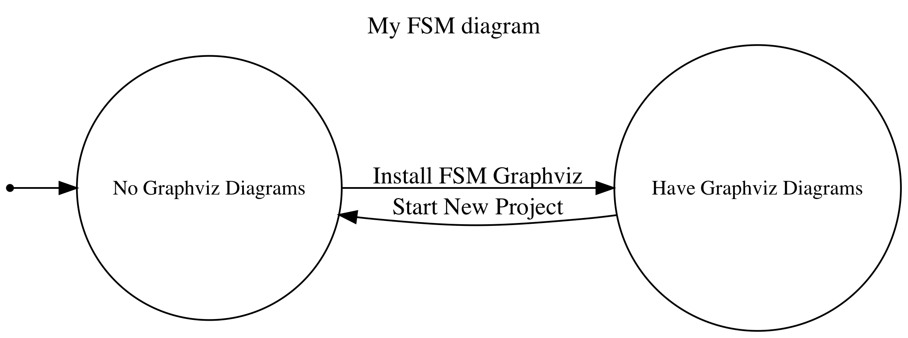

# fsmGraphviz

A go library for creating graphviz diagrams using data structures from <https://github.com/looplab/fsm>.

You need graphviz installed to actually create the diagrams, this just creates the graphviz information.

<!--  -->

## Usage

The only function that this library provides `CreateGraphvizString`, will take a set of FSM information and return the graphviz string. 

The suggestion is to add a new package to your program similar to the `usage/` folder in this repository. This package will generate a small, standalone binary that prints the graphviz information to stdout. You can then pipe this output directly to graphviz. `go generate` can be used to streamline this process:

    //go:generate bash -c "go build && ./usage | dot -Tpng -Gdpi=300 -o myFsm.png"

The `usage/` folder has the example.

